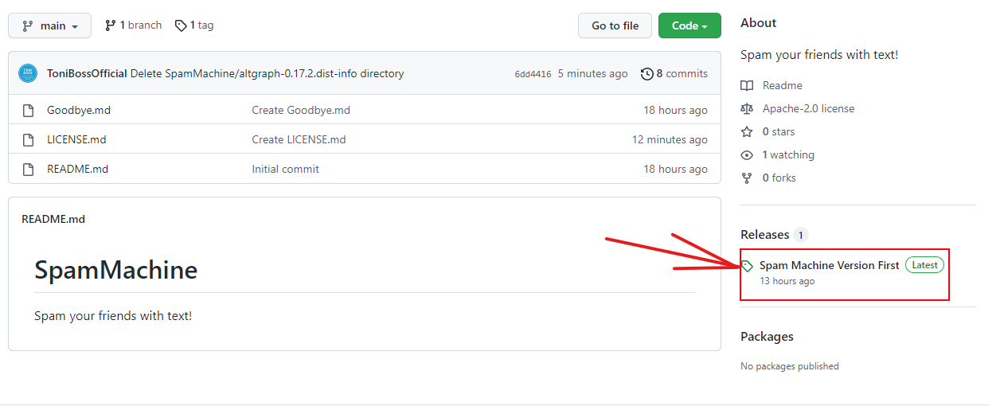
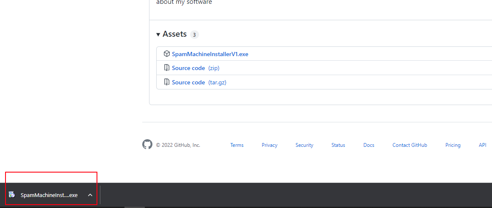

<!--
*** Thanks for checking out the Best-README-Template. If you have a suggestion
*** that would make this better, please fork the repo and create a pull request
*** or simply open an issue with the tag "enhancement".
*** Don't forget to give the project a star!
*** Thanks again! Now go create something AMAZING! :D
-->

<!-- PROJECT SHIELDS -->
<!--
*** I'm using markdown "reference style" links for readability.
*** Reference links are enclosed in brackets [ ] instead of parentheses ( ).
*** See the bottom of this document for the declaration of the reference variables
*** for contributors-url, forks-url, etc. This is an optional, concise syntax you may use.
*** https://www.markdownguide.org/basic-syntax/#reference-style-links
-->

<!-- PROJECT LOGO -->
 

  

  <h1 align="center">Spam Machine</h1>

  

    Spam your friends with text!
     
    <a href="https://github.com/ToniBossOfficial/SpamMachine/edit/main/README.md"><strong>Explore the docs »</strong></a>
     
     
  

<!-- ABOUT THE PROJECT -->
## About The Project

(<a href="#top">back to top</a>)

### Built With

This section list major frameworks/libraries used to bootstrap our project.

* [Python](https://www.python.org/)
* [PyGame](https://www.pygame.org/)
* [PyAutoGUI](https://pyautogui.readthedocs.io/en/latest/)

(<a href="#top">back to top</a>)

<!-- GETTING STARTED -->
## Getting Started

Once you have installed the software you should run it. Once you run it you can type on the 2 input box your 2 lines of text you want to be spammed. After that you can press start. Once you press start you have 5 seconds before the programm starts typing your text. In that space you should open your tab (like a messanger) and click on the box where you usually type. <b>TO STOP THE MACHINE you have to put your mouse cursor on the top right corner of the screen!</b> Have fun, use carefully.

### Installation

1. Click on the latest release. [https://github.com/ToniBossOfficial/SpamMachine/releases/](https://github.com/ToniBossOfficial/SpamMachine/releases/)
 
2. Click and download the latest release installer file. (Ends with .exe)
 
4. Run the .exe File you have just downloaded to start the installation procces.
 
5. There might appear a warning screen by windows defender, this screen pops up because my software isn't verified by microsoft (it needs an license) so you SHOULD click More Info --> run anyway  || THIS IS AN OPEN SOURSE PROGRAMM SO IT CANNOT BE A VIRUS, it is safe :)
 

(<a href="#top">back to top</a>)

<!-- LICENSE -->
## License

Distributed under the Apache License. See `LICENSE.md` for more information.

(<a href="#top">back to top</a>)

<!-- CONTACT -->
## Contact

Toni Boss Official - 2022

Project Link: [https://github.com/ToniBossOfficial/SpamMachine](https://github.com/ToniBossOfficial/SpamMachine/)

(<a href="#top">back to top</a>)

